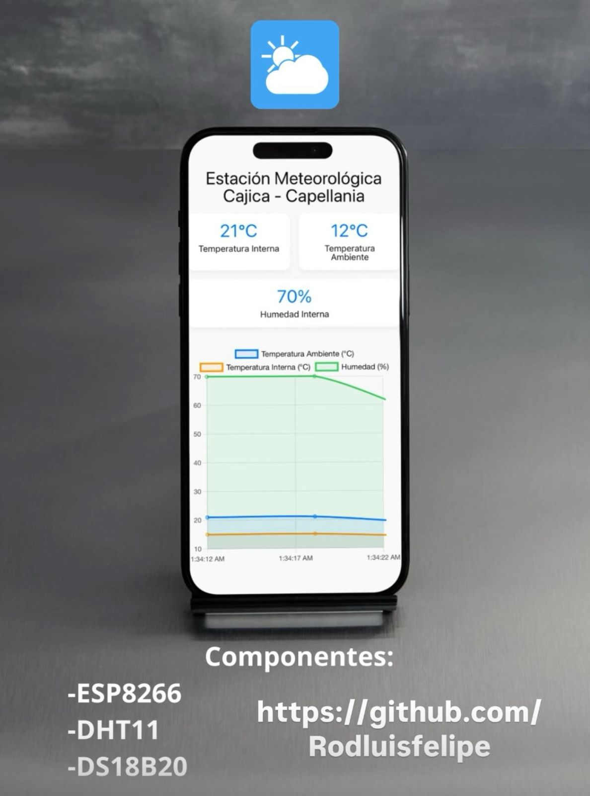

# ☁ Estación Meteorológica en Tiempo Real - Web App + IoT

Una aplicación web *responsiva, moderna y en tiempo real* que mide *temperatura y humedad* usando un *ESP8266* con sensores *DHT11* y *DS18B20, enviando los datos a **Firebase* y visualizándolos en *React* con gráficos animados.

 <!-- Reemplaza con tu imagen -->

---

## 🚀 Características

- Lectura en tiempo real de:
  - 🌡 Temperatura ambiente (DS18B20)
  - 🌡 Temperatura del aire (DHT11)
  - 💧 Humedad relativa (DHT11)
- 🔄 Sincronización automática con Firebase cada 10 segundos.
- 📱 Interfaz *100% responsive*: móvil, tablet y PC.
- 📊 Gráficos dinámicos con *Chart.js*.
- ✅ Corrección térmica directa en frontend.
- 🧩 Instalación como *PWA* (web app instalable en el celular).
- ☁ Despliegue en Vercel con dominio personalizado.

---

## 🛠 Tecnologías utilizadas

### Frontend
- ⚛ React.js
- 📈 Chart.js + react-chartjs-2
- 🎨 CSS puro con diseño responsive
- 📦 Progressive Web App (manifest.json)

### Backend (IoT)
- 📡 ESP8266 NodeMCU
- 🌡 Sensor DHT11 (temperatura y humedad)
- 🌡 Sensor DS18B20 (temperatura digital)
- 🔐 HTTPS con ESP8266HTTPClient
- 🔥 Firebase Realtime Database

---

## 🧩 Arquitectura del sistema

```plaintext
[DHT11 + DS18B20] 
        ↓ 
   [ESP8266 NodeMCU]
        ↓ 
[Firebase Realtime Database]
        ↓ 
 [React Web Application]
